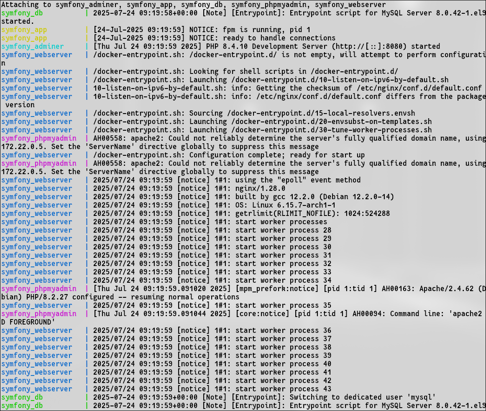
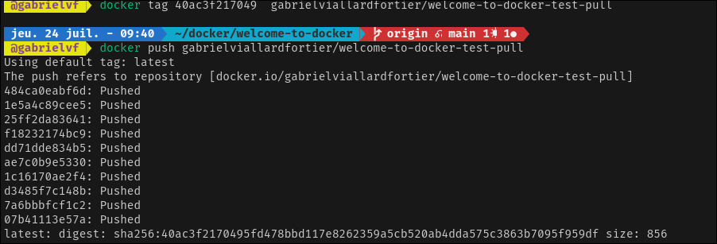

# Docker Installation & Commands for Arch Linux
## ✅ Install Docker & Docker-compose


```bash
sudo pacman -S docker && yay docker-compose
```
--------------------------------------------

## 🔐 Sign in to Docker Desktop


---------------------------
##  List all containers on local system

```bash
docker ps -a
```
##  Inspect a stopped container

```bash
docker inspect containers
```
----------------------------


## ▶️ Run a Docker Image

```bash
docker login
docker run -d -p 8088:80 --name container-name path-to-image
```


-------------------------------

## 🧹 Docker Cleanup Commands

### ❌ Stop a Container

```bash
docker stop container
```


### ❌ Remove a Specific Container

```bash
docker rm container
```

### 🧹 Stop & remove services, containers, networks

```bash
docker-compose down -v
```

### ❌ Remove Multiple Containers

```bash
docker rm container1 container2
```

### ❌ Remove All Exited Containers

```bash
docker container prune
```

### ❌ Force Remove an Active Container

```bash
docker rm -f container
```


## 🗑 Remove Docker Images

### ❌ Remove a Specific Image

```bash
docker rmi image
```

### ❌ Force Remove a Docker Image

```bash
docker rmi -f image
```

### ❌ Remove Multiple Images

```bash
docker rmi image1 image2
```

### ❌ Remove All Images

```bash
docker images purge
```


### ❌ Remove Unused Docker Images

```bash
docker system prune -a
```


## 🛠 Build a Docker Image

```bash
docker build -t welcome-to-docker .
```


## ▶️ rebuild image, start services, run container

```bash
docker compose up -d --build
```

---


##   Pull an image

```bash
docker pull karimpierrezennoune/modified-welcome-to-docker:latest
```

##   Push an image

```bash
docker tag 40ac3f217049  gabrielviallardfortier/welcome-to-docker-test-pull

docker push gabrielviallardfortier/welcome-to-docker-test-pull 
```



##   docker-compose.yml

```bash
    image: php:8.4-fpm
```
this line defines the version of php used in the container


```bash
  phpmyadmin:
    image: phpmyadmin/phpmyadmin
    ports:
        - "8082:80"
```


##  Dockerfile


```bash
FROM php:8.4-fpm
# Install system deps

RUN apt-get update && apt-get install -y \
    unzip zip curl git libzip-dev \
    && docker-php-ext-install pdo pdo_mysql zip

# Install Composer
RUN curl -sS https://getcomposer.org/installer | php && \
    mv composer.phar /usr/local/bin/composer

WORKDIR /var/www/html
```


