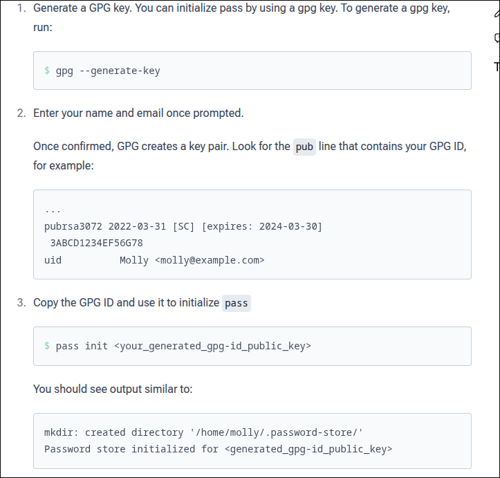
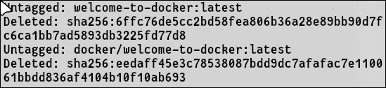
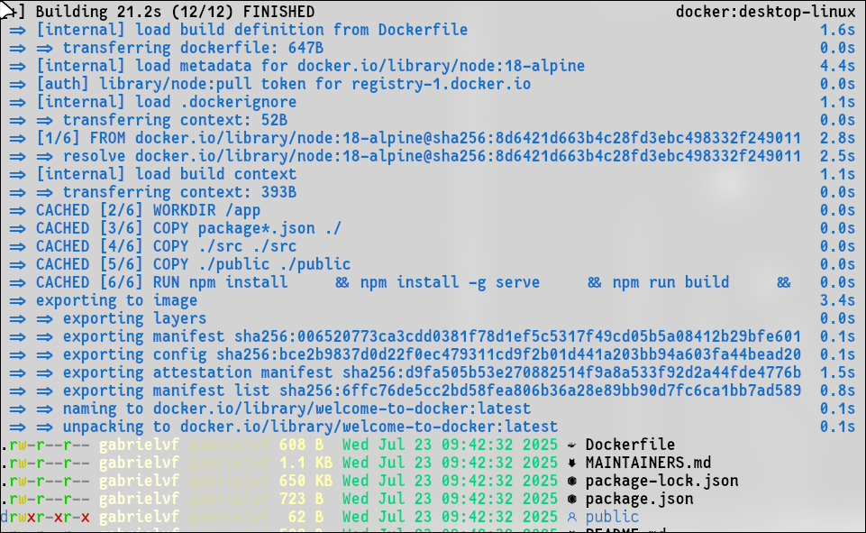
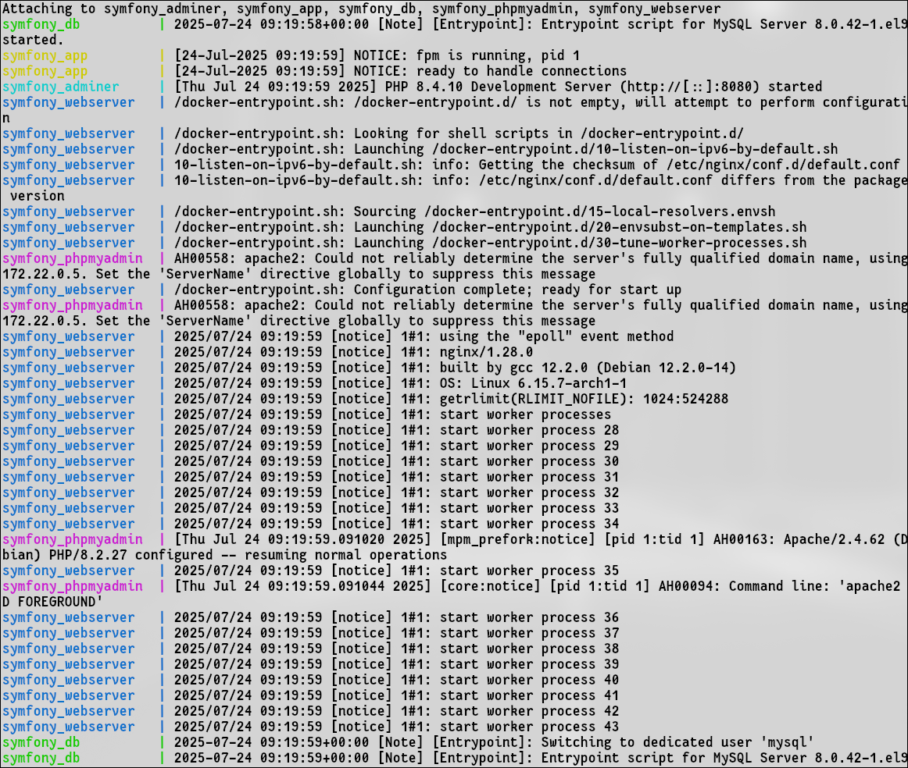
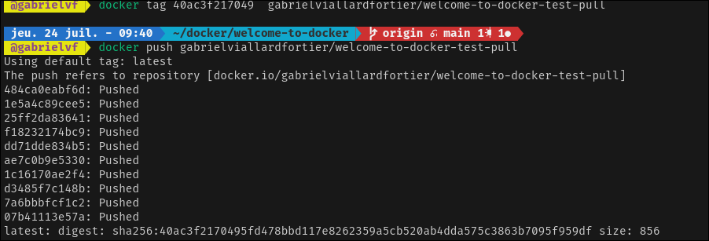

# Docker Installation & Commands for Arch Linux
## ✅ Install Docker & Docker-compose


```bash
sudo pacman -S docker && yay docker-compose
```
--------------------------------------------

## 🔐 Sign in to Docker Desktop



---------------------------
##  List all containers on local system

```bash
docker ps -a
```
##  Inspect a stopped container

```bash
docker inspect containers
```
----------------------------


## ▶️ Run a Docker Image

```bash
docker login
docker run -d -p 8088:80 --name container-name path-to-image
```


-------------------------------

## 🧹 Docker Cleanup Commands

### ❌ Stop a Container

```bash
docker stop container
```


### ❌ Remove a Specific Container

```bash
docker rm container
```

### 🧹 Stop & remove services, containers, networks

```bash
docker-compose down -v
```

### ❌ Remove Multiple Containers

```bash
docker rm container1 container2
```

### ❌ Remove All Exited Containers

```bash
docker container prune
```

### ❌ Force Remove an Active Container

```bash
docker rm -f container
```


## 🗑 Remove Docker Images

### ❌ Remove a Specific Image

```bash
docker rmi image
```

### ❌ Force Remove a Docker Image

```bash
docker rmi -f image
```

### ❌ Remove Multiple Images

```bash
docker rmi image1 image2
```

### ❌ Remove All Images

```bash
docker images purge
```



### ❌ Remove Unused Docker Images

```bash
docker system prune -a
```


## 🛠 Build a Docker Image

```bash
docker build -t welcome-to-docker .
```


## ▶️ rebuild image, start services, run container

```bash
docker compose up -d --build
```

---


##   Pull an image

```bash
docker pull karimpierrezennoune/modified-welcome-to-docker:latest
```

##   Push an image

```bash
docker tag 40ac3f217049  gabrielviallardfortier/welcome-to-docker-test-pull

docker push gabrielviallardfortier/welcome-to-docker-test-pull 
```



##   docker-compose.yml

```bash
version: "3.8"

services:
  app:
    image: php:8.4-fpm
    container_name: symfony_app
    working_dir: /var/www/html
    volumes:
      - ./app:/var/www/html
      - app_logs:/var/log/php
      - app_cache:/var/www/html/var
    networks:
      - symfony_network

  webserver:
    image: nginx:stable
    container_name: symfony_webserver
    ports:
      - "8080:80"
    volumes:
      - ./app:/var/www/html
      - ./nginx:/etc/nginx/conf.d
      - nginx_logs:/var/log/nginx
    depends_on:
      - app
    networks:
      - symfony_network

  database:
    image: mysql:8.0
    container_name: symfony_db
    environment:
      MYSQL_ROOT_PASSWORD: root
      MYSQL_DATABASE: symfony
      MYSQL_USER: symfony
      MYSQL_PASSWORD: symfony
    ports:
      - "3307:3306"  # ⚠️  Utilise 3307 local si 3306 est déjà pris
    volumes:
      - db_data:/var/lib/mysql
    networks:
      - symfony_network

  adminer:
    image: adminer
    container_name: symfony_adminer
    restart: always
    ports:
      - "8081:8080"
    depends_on:
      - database
    networks:
      - symfony_network

  phpmyadmin:
    image: phpmyadmin/phpmyadmin
    container_name: symfony_phpmyadmin
    restart: always
    ports:
      - "8082:80"
    environment:
      PMA_HOST: symfony_db
      MYSQL_ROOT_PASSWORD: root
      PMA_PMADB: phpmyadmin
      PMA_CONTROLUSER: symfony
      PMA_CONTROLPASS: symfony
    depends_on:
      - database
    networks:
      - symfony_network
    volumes:
      - phpmyadmin_data:/var/lib/phpmyadmin

networks:
  symfony_network:
    driver: bridge

volumes:
  db_data:
  phpmyadmin_data:
  app_logs:
  app_cache:
  nginx_logs:

```
this line defines the version of php used in the container


```bash

```


##  Dockerfile


```bash
FROM php:8.4-fpm

# Install system deps
RUN apt-get update && apt-get install -y \
    unzip zip curl git libzip-dev \
    && docker-php-ext-install pdo pdo_mysql zip

# Install Composer
RUN curl -sS https://getcomposer.org/installer | php && \a
    mv composer.phar /usr/local/bin/composer

WORKDIR /var/www/html
```


## default.conf

```bash
server {
    listen 80;
    server_name localhost;

    root /var/www/html/public;
    index index.php index.html;

    location / {
        try_files $uri /index.php$is_args$args;
    }

    location ~ \.php$ {
        include fastcgi_params;
        fastcgi_pass app:9000;
        fastcgi_index index.php;
        fastcgi_param SCRIPT_FILENAME $document_root$fastcgi_script_name;
        fastcgi_param DOCUMENT_ROOT $document_root;
    }
}
```


###   DockerHub personnal repo


https://hub.docker.com/repositories/gabrielviallardfortier

