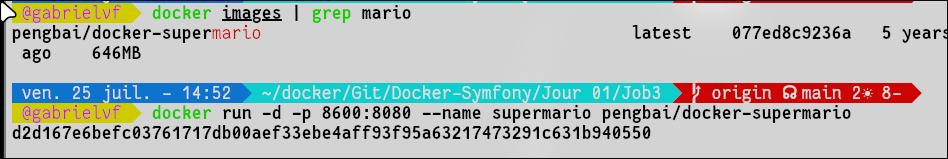
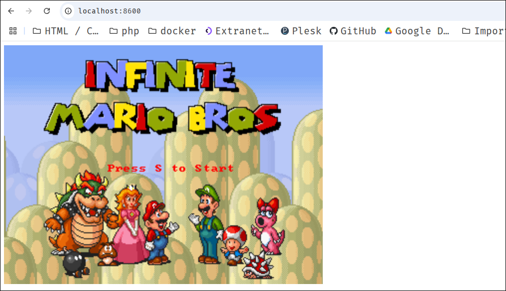
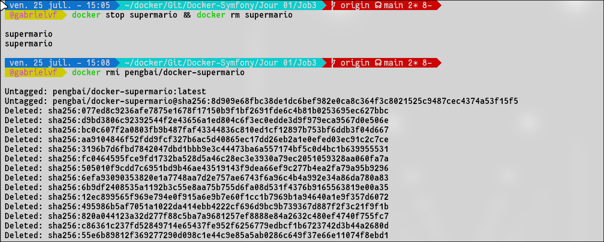

# Docker Super Mario

## ❌ No docker-desktop on my Archlinux !

## Pull the image
```bash
docker pull pengbai/docker-supermario:latest

```

## Show/List Image
```bash
docker images | grep mario

```

##  Run image in container with port 8600:8080
```bash
docker run -d -p 8600:8080 --name supermario pengbai/docker-supermario

```



##  Open SuperMario

```bash
localhost:8600
```




##  Stop & Remove container 
```bash
docker rm -f supermario
```
OR
```bash
docker stop supermario && docker rm supermario
```


##  Remove Image

```bash
docker rmi pengbai/docker-supermario

```



